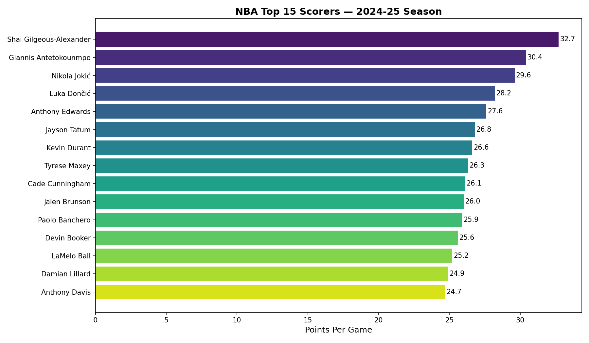
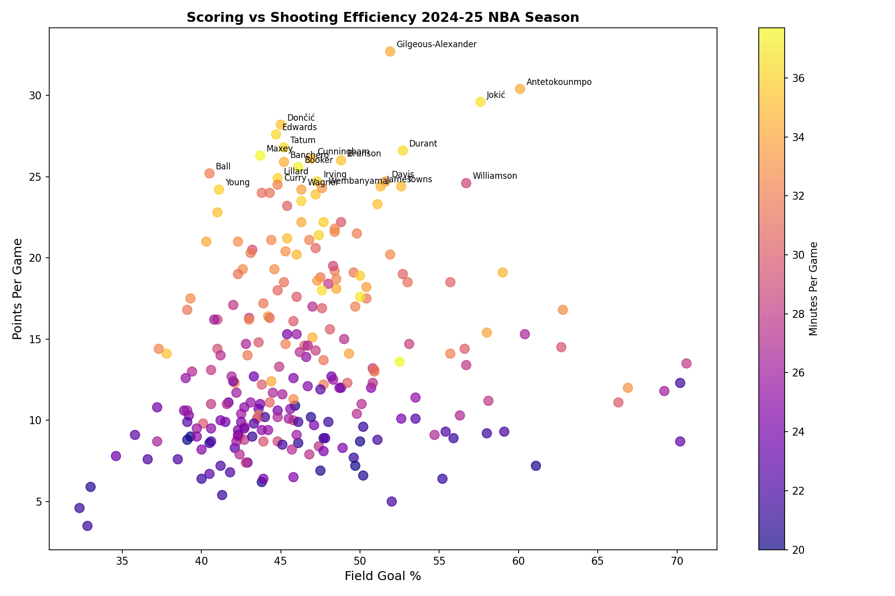

# NBA Player Performance Analyzer 🏀

End-to-end data pipeline that pulls live 2024-25 NBA season data from the official NBA API, loads it into a SQL database, and surfaces insights through analytical queries and visualizations.

## What This Project Does
- Pulls real-time player stats for all 569 NBA players via the `nba_api` library
- Loads cleaned data into a SQLite database (mirrors real-world ETL workflows)
- Answers analytical questions using pure SQL including window functions
- Visualizes findings with Matplotlib and Seaborn

## Key Findings
- **SGA leads the league** at 32.7 PPG with 51.9% FG — elite volume and efficiency
- **Denver has the most efficient offense** at 50.9% team FG — Jokić effect
- **High scorers cluster between 43-52% FG** — the cost of high-volume scoring
- Window function analysis reveals primary scorer on all 30 teams simultaneously

## Tech Stack
| Tool | Purpose |
|------|---------|
| Python | Core scripting |
| nba_api | Live data ingestion |
| SQLite | Local data warehouse |
| Pandas | Data manipulation |
| Matplotlib / Seaborn | Visualizations |

## SQL Techniques Used
- Aggregations with GROUP BY and HAVING
- Window functions (RANK, PARTITION BY)
- Filtering with WHERE and multi-condition logic
- CTEs for readable query structure

## Visualizations



## How To Run
```bash
git clone https://github.com/ZishanSha/nba-player-analysis.git
cd nba-player-analysis
pip install -r requirements.txt
jupyter notebook nba_analysis.ipynb
```
